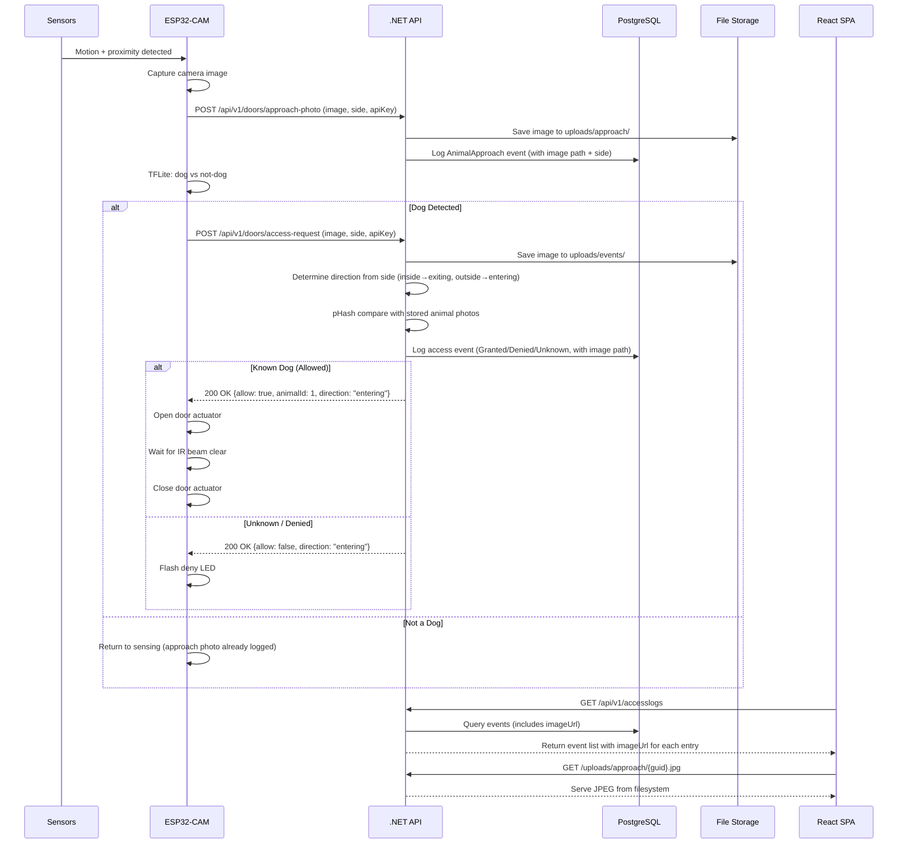

# System Architecture

## Overview

The Smart Dog Door is a multi-tier IoT system that uses edge AI to detect and identify dogs, automatically controlling a physical door mechanism.

> **Interactive version**: Open [architecture-animation.html](architecture-animation.html) in a browser to see an animated walkthrough of the full data flow.

## System Diagram

## Data Flow

## Component Details

### ESP32-CAM (Edge Device)
- **Sensors**: RCWL-0516 radar detects motion at range, HC-SR04 confirms proximity, IR break beam provides safety interlock
- **Camera**: OV2640 captures 320x240 JPEG frames
- **ML Inference**: TensorFlow Lite Micro runs a quantized MobileNet-based dog detector
- **Actuator**: 12V linear actuator controlled via L298N motor driver
- **Safety**: Reed switch monitors door position, IR beam prevents closing on animal

### .NET Web API
- **Framework**: ASP.NET Core 8.0 with Entity Framework Core 9.x
- **Database**: PostgreSQL via Npgsql EF Core provider 9.x
- **Recognition**: Perceptual hashing (pHash) compares camera images to stored animal profile photos
- **Direction Detection**: Dual-sided cameras report which side (inside/outside) triggered the request; the API infers transit direction (entering/exiting)
- **Storage**: Photos stored on filesystem (`uploads/`), paths tracked in database

### React Admin SPA
- **Stack**: React 18, TypeScript, Vite
- **Features**: Animal management, photo upload, access log viewer, door configuration
- **Demo Mode**: Supports `VITE_DEMO_MODE=true` for GitHub Pages deployment (uses HashRouter)
- **Deployment**: Static build served by nginx

### Infrastructure
- **Docker Compose**: Local development with API + SPA + PostgreSQL
- **Helm/Kubernetes**: Production deployment with configurable replicas, ingress, secrets

## API Endpoints

| Method | Endpoint | Description |
|--------|----------|-------------|
| GET | /api/animals | List all animals |
| POST | /api/animals | Create animal |
| GET | /api/animals/{id} | Get animal details |
| PUT | /api/animals/{id} | Update animal |
| DELETE | /api/animals/{id} | Delete animal |
| GET | /api/animals/{id}/photos | List animal photos |
| POST | /api/photos/upload/{animalId} | Upload photo |
| DELETE | /api/photos/{id} | Delete photo |
| POST | /api/v1/doors/approach-photo | Upload approach image for any motion detection (no-auth, apiKey in form) |
| POST | /api/v1/doors/access-request | Request door access — image + optional side + apiKey |
| POST | /api/v1/doors/firmware-event | Post firmware event (door opened/closed, power events) |
| GET | /api/v1/doors/status | Get door status |
| PUT | /api/v1/doors/configuration | Update door config |
| GET | /api/v1/accesslogs | Query access logs (includes imageUrl per entry) |
| GET | /api/v1/accesslogs/{id} | Get specific log entry |
| GET | /uploads/approach/{file} | Serve approach photo (static file) |
| GET | /uploads/events/{file} | Serve access-request photo (static file) |

## Security Considerations

- API key authentication for ESP32-to-API communication
- CORS configured for SPA origin only
- Photo uploads validated for file type and size
- SQL injection prevented by EF Core parameterized queries
- No sensitive data in Helm values (secrets managed separately)
